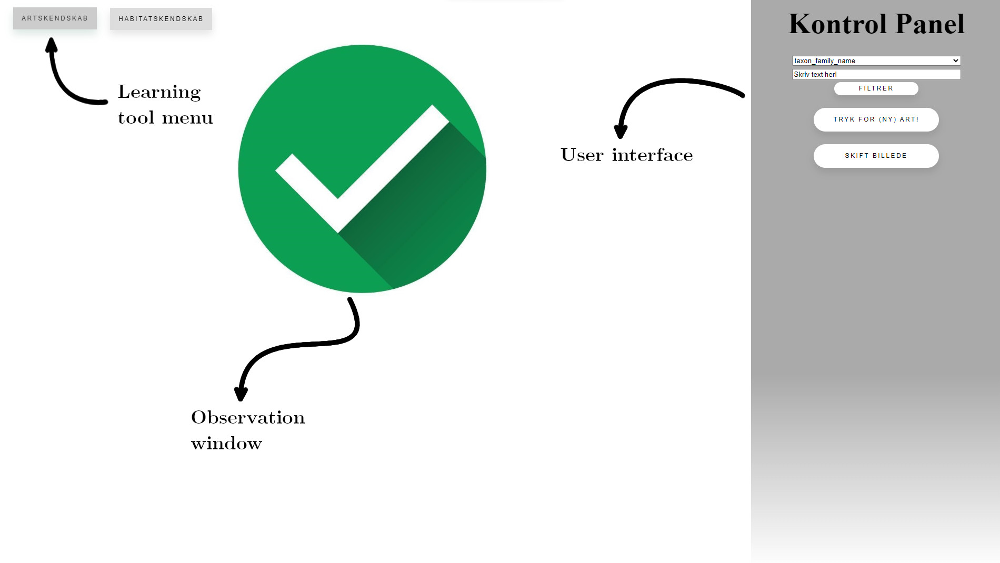

# Setup

**Important:** It is important to update R and RTools to the newest version (both can be found on [the offical website of R](https://www.r-project.org/)) and RStudio as the app has not been created with compatibility in mind. The app has been verified to work on *"R version 4.1.3 (2022-03-10)"*.

1) Make sure to install and update the following packages to ensure that the app works; **shiny**, **shinyjs**, **tidyverse**, **rjson**, **rrapply**, **magrittr**, **keys**, **extrafont**, **googlesheets4**, **kableExtra**, **furrr**, **ggpubr** and **hash**. If you are unsure if you have all these packages installed copy and run the following code (:

```
# Vector of the names of necessary packages for the app to run
necessaryPackages <- c("shiny", "shinyjs", "keys"           # Packages for shiny app functionality
                       "tidyverse", "furrr",                # ------|------data wrangling and more 
                       "rrapply", "magrittr",               # ------|------data wrangling
                       "googlesheets4", "rjson",            # ------|------data import
                       "hash",                              # ------|------efficient dictionaries
                       "extrafont", "ggpubr", "kableExtra") # ------|------plots and tables

# Loops over all the packages, try to load package, on error install package instead.
sapply(necessaryPackages, function(x) {
  tryCatch({
    library(x, character.only = T)
  },
  error = function(y) install.packages(x))
})
```


2) Open and run the R script file *"runApp.R"*.


3) A few important notes on the app in it's current state:
    *	In order to view the first observation or habitat, the user must wait until the loading wheel turns into a green checkmark and only at this point press the button "Tryk for (ny) art" or "Tryk for (ny) habitat".
    *	The app may be a bit slow, especially when used on [shinyapps.io](https://asvenning.shinyapps.io/lringsredskab_-_dansk_flora_og_vegetationskologi/?_ga=2.117524928.852255328.1662635286-946788904.1657455478) since *shinyapps.io* is a free service, but the app should execute the user input once it catches up.
    *	The app was not designed initially to be used on a server.
    * If the app freezes (which is quite possible) the user should refresh the page or restart the app, depending on how the user is using the app (*shinyapps.io* vs. locally).


# (More) Detailed information
A short description of the use and functionality of the app.

## Layout



### Learning tool menu
A menu where the user can switch between the different tools that are a part of the app.

### User interface
This is where almost all of the interactive user inputs live; buttons for requesting a new observation or habitat, changing the current observation photo, revealing the species or habitat etc.
Some of the information regarding the species that will be shown after the species is revealed can also be found here.

### Observation window
This is where the app displays the information (photo or species list) which the user can use to guess either which species is in an observation or which habitat a species list is from.
The user can also click on an image of a species and be redirected to the INaturalist observation from which the image is taken. This could be used by the user to make a new identification of the observation species, if the user believes the observation ID is wrong.

## Learning tool: Species identification
By using the user interface observation photos can be requested using the button "Tryk for (ny) art!", which will result in a photo of a plant being displayed in the observation window. If the observation which the photo originates from contains more than one photo, the button "Skift billede" will be tinted yellow. The button can then be used to switch between the images in the observation.
When the user has made their guess (which they must hold themselves accountable for in the current state of the app), the "true" species can be revealed using the button "Afslør arten!" which will also result in the following information being shown:


1)	Danish and scientific name 
    a.	familie, orden og klasse (only scientific) 
2)	List of NOVANA-habitats where the species is found (colored according to frequency)
3)	Common mix-ups
4)	Ellenberg-values
5)	The photo in the observation window is replaced by an iframe of the wikipedia entry. (**The user can switch back to the observation photos by pressing the "Skift billede" button if they want to dispute the species ID.**)

To view the next observation press the "Tryk for (ny) art!" button again!.

If the user wishes to practice on a subset of species, they can use the filter functionality at the top of the user interface (above the "Tryk for (ny) art!" button). In order to use this functionality the user must first choose a taxonomic level to filter on, then input a string in the field below and press the putton "Filtrer". This string can include multiple queries by delimiting the queries using a comma (example: level="taxon_genus_name" query="silene,cirsium,viola"). The subsetting will only occur once the next api batch query occurs (that means after a maximum of 10 observations).

There is also the possibility of using the keyboard keys 1-4 after revealing a species, to tell the app how "hard" the species was (to ID):

**1** : Easy *(0.5)*

**2** : Comfortable *(1)*

**3** : Unsure *(2)*

**4** : Difficult *(4)*

The numbers in the italic parenthesis, difficulty multiplier, are used as sampling weights and will update the currently shown species sampling weight by multiplying the difficulity multiplier. This way a user can quickly ensure that they are shown more and more "hard" species and less and less "easy" species.


# Delredskab habitatkendskab
Her kan man anmode en artsliste vha. knappen ”Tryk for (nyt) habitat!”, hvorefter en artsliste samt gennemsnitlige Ellenberg-værdier vises i observationsruden. Herefter kan man afsløre habitatet ved vha. knappen ”Afslør habitatet!”, hvorefter to informationer præsenteres:

1)	Habitatets navn, først navnet som jeg har forsøgt at oversætte fra NOVANA-typer til de, der var opgivet i vores pensum. I parentes findes habitatets ”rigtige” navn fra NOVANA, så det vil jeg nok hæfte mig mest til.
2)	Et histogram over frekvensen af de (op til 25) mest almindelige arter i habitatet (udregnet fra alle plots som findes i redskabet).

Jeg har forsøgt at oversætte de latinske navne, men dette virker kun for arter som findes på Wikipedia under det latinske navn, som er opgivet i NOVANA. Oversættelsen er en smule ustabil især for kompleks-arter og mosser, men man kan altid bruge de latinske navne i det tilfælde.

**OBS:** Dette delredskab kan være mere ustabilt end det første.

# Noter
Redskabets funktionalitet kan selvfølgelig ændres og tilpasses hvis det ønskes. Fx kan mosser fjernes fra habitaternes artslister og der kan tilføjes flere arter, datakilder til fx Ellenberg-værdier (i demoen taget fra Ellenberg et al. 1991), flere NOVANA-plots (måske med frekvens-estimater). Jeg ville fx være interesseret i at inkorporere information og/eller nøglepunkter fra Dansk Flora (bogen, hvis jeg må, men det kan man nok finde ud af). 

Ikke alle arter er repræsenteret lige godt (fx er der næsten ingen observationer af andre svingler end rød svingel og fåresvingel i iNaturalist), men alle urter og træer er selvfølgelig repræsenteret mere end tilstrækkeligt, det samme gør sig også gøre for de fleste siv og halvgræsser, men græsserne halter lidt. Jeg kan evt. undersøge, om der er flere billeder af disse tilgængelig i andre databaser.

Til sidst vil jeg understrege at demo’en er meget midlertidig. Det vil sige at jeg bruger en gratis (langsom) server, samt at app’en vil stoppe med at virke efter at den bruges i et stykke tid. Derudover er jeg også opmærksom på, at nogle dele af brugerfladen er noget uigennemskuelige eller counter-intuitive. Det skyldes primært at jeg havde begrænset tid til at udvikle redskabet (jeg skulle jo egentlig læse til eksamen!), og at jeg kan se og rette fejl som de opstår, når jeg bruger redskabet lokalt på min pc. Disse problemer vil være den umiddelbart største arbejdsbyrde, hvis redskabet skal kunne udnyttes af et hold studerende gnidningsfrit og vil derfor være min prioritet!

Kommentarer, observationer og spørgsmål modtages med glæde!
