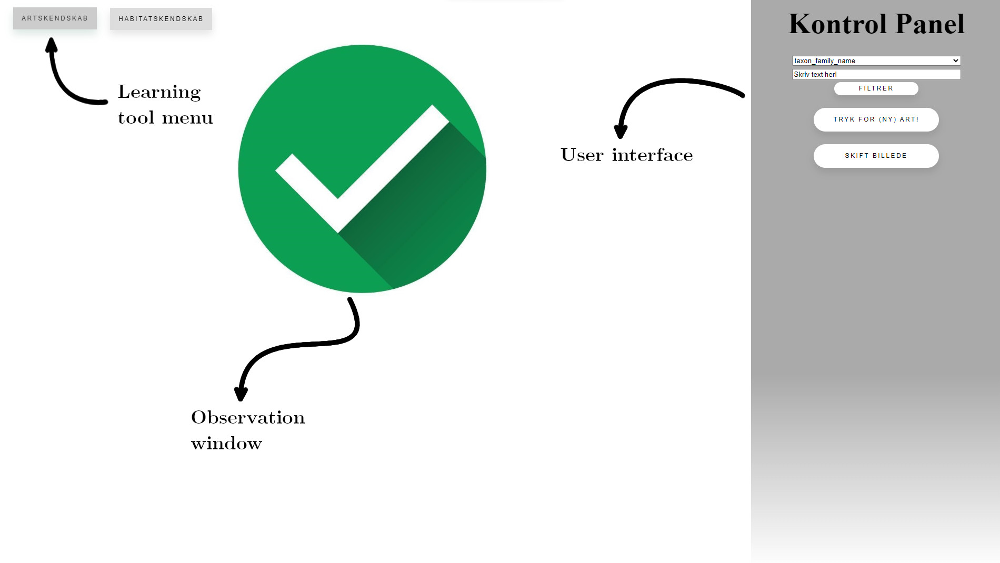

<center></center>

<br>

# Setup

**Important:** It is important to update R and RTools to the newest version (both can be found on [the offical website of R](https://www.r-project.org/)) and RStudio as the app has not been created with compatibility in mind. The app has been verified to work on *"R version 4.1.3 (2022-03-10)"*.

The app can then simply be installed as a package from Github:
```
remotes::install_github("asgersvenning/Dansk-Flora-App")

```
The app can then be run by calling the `run_app` function:
```
learnDFV::run_app()
```


# Detailed Information and Documentation

A short description of the use and functionality of the app.

## Layout



### Learning Tool Menu

A menu where the user can switch between the different tools that are a part of the app.

### User Interface

This is where almost all of the interactive user inputs live; buttons for requesting a new observation or habitat, changing the current observation photo, revealing the species or habitat etc. Some of the information regarding the species that will be shown after the species is revealed can also be found here.

### Observation Window

This is where the app displays the information (photo or species list) which the user can use to guess either which species is in an observation or which habitat a species list is from. The user can also click on an image of a species and be redirected to the INaturalist observation from which the image is taken. This could be used by the user to make a new identification of the observation species, if the user believes the observation ID is wrong.

## Learning tool: Species identification

By using the user interface observation photos can be requested using the button "Tryk for (ny) art!", which will result in a photo of a plant being displayed in the observation window. If the observation which the photo originates from contains more than one photo, the button "Skift billede" will be tinted yellow. The button can then be used to switch between the images in the observation. When the user has made their guess (which they must hold themselves accountable for in the current state of the app), the "true" species can be revealed using the button "Afslør arten!" which will also result in the following information being shown:

1)  Danish and scientific name
    a.  familie, orden og klasse (only scientific)
2)  List of NOVANA-habitats where the species is found (colored according to frequency)
3)  Common mix-ups
4)  Ellenberg-values
5)  The photo in the observation window is replaced by an iframe of the wikipedia entry. (**The user can switch back to the observation photos by pressing the "Skift billede" button if they want to dispute the species ID.**)

To view the next observation press the "Tryk for (ny) art!" button again!.

If the user wishes to practice on a subset of species, they can use the filter functionality at the top of the user interface (above the "Tryk for (ny) art!" button). In order to use this functionality the user must first choose a taxonomic level to filter on, then input a string in the field below and press the putton "Filtrer". This string can include multiple queries by delimiting the queries using a comma (example: level="taxon_genus_name" query="silene,cirsium,viola"). The subsetting will only occur once the next api batch query occurs (that means after a maximum of 10 observations).

There is also the possibility of using the keyboard keys 1-4 after revealing a species, to tell the app how "hard" the species was (to ID):

**1** : Easy *(0.5)*

**2** : Comfortable *(1)*

**3** : Unsure *(2)*

**4** : Difficult *(4)*

The numbers in the italic parenthesis, difficulty multiplier, are used as sampling weights and will update the currently shown species sampling weight by multiplying the difficulity multiplier. This way a user can quickly ensure that they are shown more and more "hard" species and less and less "easy" species.

## Learning Tool: Habitat Knowledge

The main functionality of this tool is to allow the user to sample the species pool of a real NOVANA plot, which they can then try to guess. The tool also calculates mean Ellenberg scores (for the species with available data) as well as shows the vernacular (if available) and scientific name. The user can request a new plot using the button "Tryk for (nyt) habitat!", which will reveal the aforementioned species list and Ellenberg scores.

After the user has guessed on the habitat type of the plot in question, the answer can be revealed by the user pressing the button "Afslør habtiatet!", which will reveal the following information:

1)  The habitat name. The first name is a "translated" name in accordance with the curriculum of last year, while the second name in parentheses is the official NOVANA habitat name.

2)  A species frequency histogram of the up to 25 most common species in the habitat (not just the current plot, which only contains presence/absence data from my data source).

I have attempted to translate the scientific Latin names using Wikipedia, but this only works in case there is a Wikipedia entry of the species under the scientific name used in NOVANA. This has caused the translation to become a little unstable especially for "uncharismatic", cryptic or rare species, but it works quite well for vascular plants.

**PSA:** This tool can be more unstable than the first.

# Notes

A major drawback of this learning application in it's current state, is the imbalance between charismatic and uncharismatic species in the "Species Identification" learning tool, which in essence could reenforce this bias in the learner. This bias also extends to the translation of names, extra information on the species etc. This tool also currently only contains species from the previous year's curriculum, which might be undesirable.

For the other learning tool "Habitat Knowledge", there is also bias in the number of plots in each habitat type, however I think it is a reasonable assumption that this bias reflects the actual frequency of habitats, at least to a large degree. However an issue with this tool that I and others have noticed, is that the translation from NOVANA habitats to curriculum habitats (which was done using a manual dictionary created by me), was less than ideal. Also some habitats are basically impossible to distinguish, at least when the species lists are short (which differs between plots.
